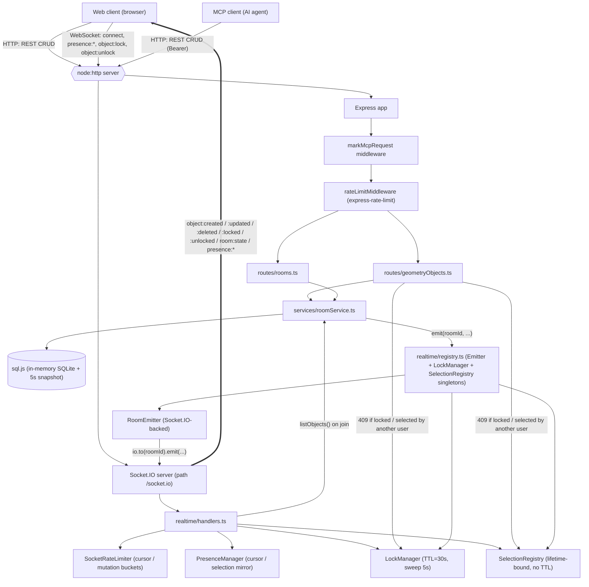

# Server architecture: HTTP + WebSockets

## Why WebSockets exist in this project

The polypad.ink editor is a multi-user 3D scene editor. Its HTTP API (`/rooms/:id/objects`, etc.) is fine for persisting geometry, but on its own it can only answer questions clients *ask*. Three jobs require the server to *push*:

1. **Other users' edits.** When user A places, moves, recolors, resizes, or deletes a shape, users B/C/D need to see it within ~tens of ms — not on the next poll.
2. **Ephemeral collaboration state** that doesn't belong in the database — cursor positions and which user is dragging which object. Polling for these would either be wasteful (high frequency) or laggy (low frequency).
3. **Coordinated single-user interaction.** Two concerns share this need: (a) soft locks on geometry actively being dragged, so the holder keeps it for the duration of the drag; (b) selection ownership, so once a user has selected an object for menu-driven edits, no one else can claim it. Both require everyone to be told instantly when ownership is acquired or released. With HTTP-only, the only safe answer would be "always reject concurrent edits," which is a bad UX.

WebSockets are the right fit because they're cheap to keep open, support server→client push, and let us fan out a single mutation to N peers without N HTTP round-trips.

## High-level architecture

The server is a single Node process that owns one `http.Server`. Express handles HTTP traffic on it; Socket.IO mounts on the same server at `/socket.io`. They share the port, the host, and the CORS origin — but their concerns are different and clean:

| Concern | Owner | Why |
|---|---|---|
| Durable geometry CRUD | HTTP routes → service → SQLite (sql.js) | Bounded request/response shape, simple retries, easy MCP integration |
| Initial state on join | WebSocket `room:state` event | Avoids a separate HTTP round-trip after connecting |
| Cursor presence | WebSocket only (`presence:cursor`) | Pure ephemeral data, fire-and-forget, never persisted |
| Selection ownership | WebSocket (`presence:selection` ack) + in-memory `SelectionRegistry` | Authoritative: at most one user can hold an object's selection. No TTL — held until released or disconnect |
| Soft locks (drag) | WebSocket (`object:lock` ack) + in-memory `LockManager` | TTL-leased (30 s) for the duration of a drag; distinct from selection ownership |
| Mutation broadcasts (`object:created` / `:updated` / `:deleted`) | Services emit; Socket.IO fans out | Mutation source can be HTTP **or** WS; one broadcast path keeps clients in sync |
| Rate limiting | `express-rate-limit` (HTTP) + `SocketRateLimiter` (WS, per socket) | Different attack surfaces, different limits |

### The emitter registry: decoupling services from Socket.IO

Routes and services don't import Socket.IO. They import a small interface:

```ts
// realtime/emitter.ts
export interface RoomEmitter {
  emit(roomId, event, payload): void;
}
```

A registry singleton (`realtime/registry.ts`) holds the current emitter — initially a `NoopEmitter`, swapped to a real Socket.IO-backed one inside `initRealtime()` at boot. This means:

- Services like [`createObject`](src/services/roomService.ts) just call `getEmitter().emit(roomId, "object:created", { ... })` — they don't know or care that Socket.IO exists.
- Tests can run service code without booting Socket.IO; the noop swallows emits.
- A future replacement (Redis pub/sub for multi-instance deploys, an in-memory bus for tests) only requires implementing `RoomEmitter`.

The same pattern is used for the `LockManager` and the `SelectionRegistry` — single instances, exposed via `getLockManager()` / `getSelectionRegistry()`. Both are consulted by the HTTP route (to reject 409s on locked-or-selected objects) and the Socket.IO handlers (to grant / release ownership and broadcast the result).

## Connection lifecycle

A Socket.IO connection carries `auth: { userId, displayName, roomId }` in the handshake. The `connection` handler:

1. Validates auth — disconnect if missing.
2. Checks `presence.count(roomId) < MAX_USERS_PER_ROOM` — if not, emits `room:full` and disconnects.
3. Joins the Socket.IO room (`socket.join(roomId)`) so future `io.to(roomId).emit(...)` reaches it.
4. Records presence and broadcasts `presence:joined` to peers.
5. Reads the current geometry from the DB (`listObjects`) and emits `room:state` to *just this socket*, with users + locks + objects — the client's full initial picture in one message.
6. Wires up event handlers behind a `SocketRateLimiter` (separate token buckets for cursor moves vs. mutations, since cursors are spammy by nature).

The ordering of steps 4 and 5 is deliberate: `presence:joined` fires *before* the DB read so peers see the new user the moment their socket connects, rather than after the joiner's `listObjects` returns. The joiner's own scene fills in shortly after via `room:state`.

On disconnect: presence is cleaned up, `presence:left` is broadcast, locks held by this user expire naturally on the next sweep, and any selection ownership is released from the `SelectionRegistry` immediately.

## Locks and selection: coordinating concurrent interaction

Two related-but-distinct ownership mechanisms govern concurrent edits. Both live in-memory, are consulted by the HTTP guard, and are released on disconnect; they differ in lifetime and in what they protect.

### Drag locks

`LockManager` is a per-room `Map<objectId, { userId, expiresAt }>`. The drag flow:

1. Client requests a lock via `object:lock` (with ack callback).
2. Server grants if no other user holds the lock, then `io.to(roomId).emit("object:locked", ...)` so everyone updates UI (e.g. ghost outline).
3. While dragging, the client sends position updates over HTTP `PATCH` (which scope by `roomId` + `objectId` and reject 409 if locked by someone else). On each update, `lockManager.touch(...)` extends the lease.
4. On drop, the client sends `object:unlock` → broadcast `object:unlocked`.
5. A 5-second sweeper (`LOCK_SWEEP_MS`) drops expired leases (TTL = 30s, `LOCK_TTL_MS`) and emits `object:unlocked` for each — covers crashes, network drops, and inattentive users.

### Selection ownership

`SelectionRegistry` is a per-room `Map<objectId, userId>` — no TTL. It enforces the invariant *at most one user has a given object selected at any time*, and the corollary *each user has at most one selection*.

The selection flow:

1. Client requests selection via `presence:selection` `{ objectId }` (with ack callback). `objectId: null` is a release request.
2. Server captures the user's prior selection (if any) and calls `acquire(roomId, objectId, userId)`:
   - If another user already holds it → ack `{ ok: false, selectedBy }`. **No** server-side state changes; the client rolls its local selection back to its prior value and surfaces a toast.
   - Otherwise → release the user's prior selection (single-selection invariant), update `presence.setSelection`, broadcast `presence:selection` to peers, ack `{ ok: true }`.
3. On disconnect, `selectionRegistry.releaseAllForUser(roomId, userId)` clears the user's holds immediately — peers learn via the existing `presence:left` event.

Both `LockManager` and `SelectionRegistry` reject HTTP `PATCH` / `DELETE` with **409** when the caller doesn't hold the relevant claim. The route checks the lock first (`{ error: "locked", lockedBy }`), then the selection (`{ error: "selected", selectedBy }`).

MCP-tier requests (bearer-authenticated) **bypass** both checks at the route level — AI agents don't deal with selection or lock UX, they get a free pass.

## Mutation broadcast model

The interesting design choice: mutations come in over HTTP (REST CRUD or batch), but they're broadcast over WS. So the flow for any geometry change is:

1. HTTP request lands on Express → route → service.
2. Service runs the DB transaction (cap check, FK upsert, write, etc.).
3. Service calls `getEmitter().emit(roomId, "object:created" | "object:updated" | "object:deleted", payload)`.
4. The emitter calls `io.to(roomId).emit(...)`, fanning out to every connected socket in that room — *including the originating client*, which lets the originator's WS handler reconcile its optimistic state with canonical server state.

This means the WS layer is the **single source of truth** for "what changed in the room," regardless of who or what produced the change. An MCP agent placing 50 boxes via `POST /objects/batch` produces 50 `object:created` broadcasts that every browser tab in the room receives just like a manual placement.

## Rate limiting

Two independent layers:

- **HTTP** — `express-rate-limit` middleware: 100 requests / 15 minutes / IP by default. Bypassed for MCP bearer-authenticated requests so AI traffic isn't penalised.
- **WS per-socket** — `SocketRateLimiter` token bucket, 25 cursor msgs/sec and 20 mutation msgs/sec. Cursors and locks are throttled separately because cursor spam shouldn't crowd out a legitimate `object:lock` request.

## Architecture diagram



The double-line at the bottom is the **broadcast path**: a single mutation, regardless of whether it originated from HTTP (browser or MCP) or from a WS event (lock acquisition), produces one fan-out emit to every socket in the room.

## File map

```
src/
  index.ts              # Boots Express + Socket.IO on one http.Server
  realtime/
    index.ts            # initRealtime() — creates Socket.IO, wires emitter + sweeper
    emitter.ts          # RoomEmitter interface + NoopEmitter
    registry.ts         # Singleton emitter + lockManager + selectionRegistry (decouples services from io)
    handlers.ts         # Per-connection lifecycle and event handlers
    presence.ts         # Per-room cursor/selection mirror (for broadcast snapshots)
    locks.ts            # TTL-based per-object lease tracking (drag)
    selections.ts       # Lifetime-bound per-object ownership (selection)
    socketRateLimit.ts  # Per-socket cursor/mutation token buckets
    metrics.ts          # Rolling-window join-latency sampler (debug-only)
    eventTypes.ts       # Wire types for all WS events (server↔client)
  services/roomService.ts  # Calls getEmitter() after every DB mutation
  routes/                  # HTTP layer; never imports Socket.IO
  middleware/rateLimit.ts  # markMcpRequest + express-rate-limit config
```

## Why not an HTTP-only design?

This was considered. The killer cases:

- **Cursor latency.** A cursor update at 30 Hz over HTTP-long-polling costs a fresh request per frame per peer. Over WS, it's one persistent connection per user with one frame per update.
- **Lock acquisition races.** With HTTP, two clients trying to grab the same object would both POST a lock request and only the lock-manager response tells them who won. With WS acks, the round-trip stays inside one persistent connection — no per-request TCP+TLS overhead, much faster perceived response.
- **Mutation broadcast.** Without WS, every client would have to poll `/rooms/:id/objects` to see other users' edits. Even a 1-second poll multiplies traffic by *N peers* and adds a full second of perceived lag for any change.

WebSockets aren't free — they require a stickier deployment model (each instance must be reachable by its connected clients; horizontal scaling needs a Redis adapter or similar). But for this workload, the alternative is significantly worse on both UX and bandwidth.

## Extension points

- **Multi-instance deploys.** Replace the in-process emitter with a Socket.IO Redis adapter; replace `LockManager`'s `Map` with a Redis-backed implementation that respects TTLs (`SET ... EX 30 NX` semantics), and `SelectionRegistry`'s `Map` with a Redis hash keyed on `room → objectId → userId` tied to socket lifetime (e.g. cleaned up via an `on-disconnect` Lua script).
- **Server-side join timings.** A `DEBUG_RT=1` startup flag enables per-connection phase logs and a `GET /__metrics` endpoint exposing a rolling p50 / p95 / max of `total` join latency — useful when verifying that a peer's `presence:joined` arrives at peers before the DB read finishes. Off by default in production.
- **Persistent presence/audit.** Sit a second emitter behind the existing one to also publish to a Vercel Queue / Kafka topic for analytics or replay.
- **Client-supplied request IDs.** Currently the originating client sees its own optimistic placement plus the broadcast `object:created` (with a server-assigned id) and reconciles via `invalidateQueries`. A `clientRequestId` echoed in the broadcast payload would let the originator dedup precisely without a refetch — see the security-fix follow-up notes.
- **Granular per-room rate limiting.** Today HTTP throttling is per IP. Authenticated tiers (with proper auth — see `actor` notes in the security review) could be per-user, per-room, or per-tenant.
